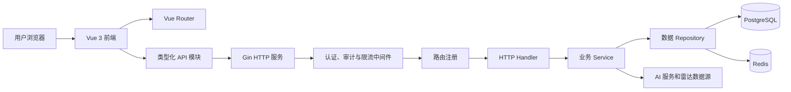
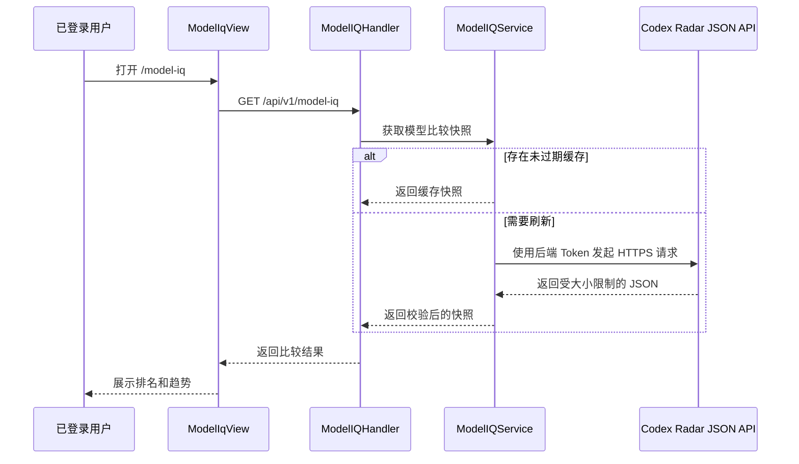

# 4Sub2 私有项目开发与架构说明

本文档用于说明 4Sub2 的私有功能、源代码架构，以及团队后续协作开发时应遵循的约定。

[Git 与 Agent 协作规范](GIT_WORKFLOW.md) | [本地开发指南](DEV_GUIDE.md) | [文档边界](docs/README.md) | [历史源码恢复记录](RECOVERY.md) | [最新生产部署记录](docs/deployments/company-v0.1.164.1.md)

## 仓库信息

| 项目 | 内容 |
| --- | --- |
| 私有仓库 | `Alle-Group/sub2api` |
| 主分支 | `main` |
| 上游项目 | `Wei-Shaw/sub2api` |
| 上游基线 | `v0.1.173` / `29009f0b2ea14edf3b11ae2564fb617ff91a03b4` |
| 上游升级标签 | `v0.1.173` |
| 最近内部发布标签 | `company-v0.1.164.1` |
| 最近内部发布提交 | `f3c6895a6f0b64eb6a638e3f89ea9b86a08c7c1d` |
| 初始私有功能恢复提交 | `69c85913dc0732382eb2e1572c488b47b89b511d` |
| 同步目标源码版本 | `0.1.173` |

当前私有功能源码由官方基线、部署时保留的源码冻结包以及生产补丁重建而成。
它是一个功能等价、可以继续协作开发的源码版本，但不能声称与已经丢失的原始生产提交逐字节一致。

如需查看相对官方基线新增的全部私有代码，可执行：

```bash
git diff v0.1.173..HEAD
```

## 上游 v0.1.173 文档与功能

本仓库以这份 README 作为 4Sub2 私有功能和团队协作的主说明。同步 `v0.1.173` 时，
同时更新了上游的 [中文说明](README_CN.md) 和 [日文说明](README_JA.md)，用于查阅完整的
Sub2API 公共功能、安装方式和配置项。两份上游说明中的公开仓库克隆、安装和发布命令仅供参考；
内部开发、发布和部署必须遵循 [`GIT_WORKFLOW.md`](GIT_WORKFLOW.md)。
该文档中的仓库地址是迁移前记录；当前团队仓库地址以本页“仓库信息”和本地 `origin` 为准：
`git@github.com:Alle-Group/sub2api.git`。

`v0.1.173` 在上一基线上修复 OAuth 登录补全流程的账号接管漏洞，并增加上游响应模型审计、
计费金额精度量化、Gemini 3.6 Flash 支持，以及 Codex、Grok、订阅额度、模型广场、验证码、
上游连接超时和 WebSocket 转发等修复。新开关沿用上游安全默认值；
数据库迁移 `192`、`193`、`194` 和 `195` 均为 forward-only，生产部署前必须完成备份与恢复演练。
其中 `194` 先增加 usage log 的上游响应模型审计字段，`195` 再以非事务
`CREATE INDEX CONCURRENTLY` 建立 mismatch partial index；若并发建索引中断，migration runner 会在重试前
删除同名 invalid index 后重建，发布时需监控该恢复路径和 migration ledger。

组合分组能力继续保留。管理员可以使用组合分组将请求模型解析到具体供应商，完整运维说明见
[`docs/COMPOSITE_GROUPS.md`](docs/COMPOSITE_GROUPS.md)。

## 私有新增功能

### 1. Model IQ 模型能力对比

Model IQ 为已登录用户提供 GPT 模型测试结果对比页面。页面会依次按照得分、
通过任务数、成本、执行耗时和名称对不同模型配置进行排序，并计算近期得分趋势。

后端职责：

- 代理 Codex Radar JSON 接口，不向浏览器暴露上游 API Token。
- 校验上游地址、响应类型、响应大小和 JSON 数据结构。
- 在服务进程内缓存成功结果。
- 上游刷新失败时返回最后一次成功数据，并标记 `stale: true`。
- 将上游异常转换为稳定、可控的应用错误，不返回敏感错误正文。

前端职责：

- 提供桌面表格和移动端列表两套展示布局。
- 展示得分、通过率、Token 使用量、成本、耗时和近期趋势。
- 处理加载、刷新、旧数据、未授权、限流和网络错误状态。
- 页面离开或重复刷新时取消已经失效的请求。

核心文件：

- [`backend/internal/service/model_iq_service.go`](backend/internal/service/model_iq_service.go)
- [`backend/internal/handler/model_iq_handler.go`](backend/internal/handler/model_iq_handler.go)
- [`backend/internal/handler/model_iq_handler_test.go`](backend/internal/handler/model_iq_handler_test.go)
- [`frontend/src/api/modelIq.ts`](frontend/src/api/modelIq.ts)
- [`frontend/src/views/user/ModelIqView.vue`](frontend/src/views/user/ModelIqView.vue)
- [`frontend/src/views/user/__tests__/ModelIqView.spec.ts`](frontend/src/views/user/__tests__/ModelIqView.spec.ts)

### 2. 多上游内容审核

管理员可以在「管理后台 → 风控中心 → 内容审计设置」选择内容审核上游协议：

- `OpenAI Moderations`：直接调用配置的 Base URL 下的 `/v1/moderations`。
- `Anthropic Messages`：直接调用配置的 Base URL 下的 `/v1/messages`，使用 `x-api-key` 和
  `anthropic-version` 请求头，并强制模型调用审核工具返回完整的结构化分类分数。

两种协议共用现有的多 API Key 轮询、失败冻结、超时、重试、代理服务器、前置拦截和异步观察机制。
Anthropic 路径支持文本、HTTP(S) 图片和最大 8 MiB 的受支持图片格式 base64 data URL；用户内容始终
作为不可信审核输入发送，不会拼接到系统指令中。工具启用严格 JSON Schema，输出必须恰好包含一次
指定工具调用、全部审核类别和 0–1 范围内的分数。Anthropic 明确拒绝或返回无法验证的 2xx 结果时，
`pre_block` 模式返回 503，避免把未审核内容放行；网络错误仍沿用原有策略。旧配置没有
`upstream_protocol` 字段时继续默认使用 `openai_moderations`，无需迁移数据库或设置记录。

核心文件：

- [`backend/internal/service/content_moderation.go`](backend/internal/service/content_moderation.go)
- [`backend/internal/service/content_moderation_anthropic.go`](backend/internal/service/content_moderation_anthropic.go)
- [`backend/internal/service/content_moderation_anthropic_test.go`](backend/internal/service/content_moderation_anthropic_test.go)
- [`backend/internal/handler/admin/content_moderation_handler.go`](backend/internal/handler/admin/content_moderation_handler.go)
- [`frontend/src/api/admin/riskControl.ts`](frontend/src/api/admin/riskControl.ts)
- [`frontend/src/views/admin/RiskControlView.vue`](frontend/src/views/admin/RiskControlView.vue)

### 3. 分组模型价格展示

用户可以在 API Key 页面查看每个可见分组支持的模型价格。鼠标悬停或键盘聚焦
分组标签时，会显示输入、输出、缓存读取、缓存写入、按次或图片价格。

后端接口只返回当前用户有权访问的分组和模型。该功能复用现有渠道可用性和定价规则，
不会建立第二套计费数据源。

核心文件：

- [`backend/internal/handler/available_channel_handler.go`](backend/internal/handler/available_channel_handler.go)
- [`frontend/src/api/channels.ts`](frontend/src/api/channels.ts)
- [`frontend/src/components/keys/GroupPricingPopover.vue`](frontend/src/components/keys/GroupPricingPopover.vue)
- [`frontend/src/views/user/KeysView.vue`](frontend/src/views/user/KeysView.vue)

### 4. 官方价格参考倍率

渠道可以通过 `features_config` 为不同模型配置仅用于展示的价格参考倍率：

```json
{
  "pricing_reference": {
    "source": "official",
    "multipliers": {
      "gpt-5": 0.5,
      "gpt-5-mini": 0.2
    }
  }
}
```

模型名称匹配不区分大小写，只接受大于零的数字倍率。后端返回字段为
`reference_multiplier` 和 `reference_source`。

这些倍率只用于界面展示，不会改变实际计费价格、价格解析缓存或用量计算结果。

核心文件：

- [`backend/internal/service/channel.go`](backend/internal/service/channel.go)
- [`backend/internal/service/channel_available.go`](backend/internal/service/channel_available.go)
- [`backend/internal/handler/available_channel_handler.go`](backend/internal/handler/available_channel_handler.go)
- [`frontend/src/components/channels/PricingRow.vue`](frontend/src/components/channels/PricingRow.vue)
- [`frontend/src/components/channels/SupportedModelChip.vue`](frontend/src/components/channels/SupportedModelChip.vue)

### 5. Plus 配额自动化

管理员可以在「管理后台 → Plus 用量刷新」选择一个 OpenAI 账号分组，配置自动扫描周期
和用量阈值，也可以立即发起手动扫描。自动扫描默认关闭；默认周期为 5 分钟，允许范围为
1–1440 分钟；默认阈值为 100%，允许范围为 1–100%。启用自动扫描时必须选择目标分组。

系统只处理目标分组内状态正常的 OpenAI OAuth、非影子 Plus 账号。当任一受支持的额度窗口
达到阈值且账号存在可用重置次数时，任务会消耗 1 次重置次数刷新额度窗口。页面展示上次和
下次执行时间、扫描统计和运行状态，并集中记录查询用量、查询重置次数或执行重置时出现的
401 异常；管理员可以搜索、筛选、标记异常已解决，或按当前搜索范围一键删除全部待处理
401 异常账号，账号恢复授权后也会在后续扫描中自动关闭异常。

重置流程使用 30 分钟冷却、持久化幂等 request ID 和 PostgreSQL advisory lock，避免失败重试
或多实例并发造成重复消耗。单次扫描最多并发处理 3 个账号。

核心文件：

- [`backend/internal/service/plus_quota_automation_service.go`](backend/internal/service/plus_quota_automation_service.go)
- [`backend/internal/service/openai_quota_service.go`](backend/internal/service/openai_quota_service.go)
- [`backend/internal/handler/admin/plus_quota_automation_handler.go`](backend/internal/handler/admin/plus_quota_automation_handler.go)
- [`frontend/src/api/admin/plusQuotaAutomation.ts`](frontend/src/api/admin/plusQuotaAutomation.ts)
- [`frontend/src/views/admin/PlusQuotaAutomationView.vue`](frontend/src/views/admin/PlusQuotaAutomationView.vue)

### 6. 限流账号自动恢复（Hermes）

Hermes 是默认关闭的后台恢复任务，用于重新核对仍处于限流状态的 OpenAI 和 Anthropic OAuth
账号。它只接受来自上游的新鲜、权威额度证据；只有上游返回可用状态，并且额度窗口与数据库中
保存的重置窗口匹配时，才会通过 compare-and-clear 清除限流状态。查询失败、证据缺失、窗口不匹配
或任务超时都会保持原限流状态，按 fail-closed 处理。

对于 OpenAI 全局额度，若周额度已耗尽但仍有 reset credit，Hermes 会用绑定本次限流观测的稳定
request ID 消费一次刷新次数，并在重新查询确认额度可用后恢复账号。同一次限流观测的重试会复用
request ID；Spark 维度不会消费父账号的 reset credit。

任务通过 PostgreSQL advisory lock 保证只有一个运行实例，并在清除数据库状态前检查运行时限流
状态没有被更新。当前仅支持单应用进程部署，因为进程内运行时限流状态尚不能跨应用实例失效。

核心文件：

- [`backend/internal/service/quota_recovery_service.go`](backend/internal/service/quota_recovery_service.go)
- [`backend/internal/service/quota_recovery_checker.go`](backend/internal/service/quota_recovery_checker.go)
- [`backend/internal/config/config.go`](backend/internal/config/config.go)

恢复记录中曾使用“自定义版本比较”这一表述。私有补丁中没有独立的应用升级版本比较器，
这里实际指的是 `ModelIqView.vue` 中的模型对比排序和趋势计算逻辑。

### 7. OpenAI 账号健康检测

管理员可以在「管理后台 → 账号健康检测」选择一个或多个启用或停用的 OpenAI 分组，再加载这些分组中
已有的 OpenAI 账号并按受控并发逐个检测。分组不会默认选中，变更分组范围后需要重新加载账号。
每个用于检测的账号备注必须以 `邮箱---邮件访问地址` 开头，邮件访问地址必须使用 HTTPS。检测只读取并请求
开头这两个字段，后续的手机号、短信访问地址或其他字段会被完全忽略，不参与校验、请求、脱敏或检测结果。
新备注统一使用三个连字符分隔，已有的四连字符记录也兼容读取；连续三个及以上连字符是保留分隔符，URL 内
如需使用必须进行百分号编码。空备注、缺少邮箱或邮件访问地址、混合无效行以及多行记录都会作为“格式问题检测失败”
保留在结果表中，不会阻断其他账号。

检测请求只提交账号 ID 和所选分组 ID；服务端重新校验账号与分组的绑定关系、读取账号备注并访问邮件页面，
识别 Plus、封禁、恢复、风险警告、账号不匹配、邮件日期和付款方式等证据。页面支持筛选、排序、分页、
1–10 并发和随时停止，并展示 Plus 日期、封禁日期、存活时长、证据分、邮件数、耗时与检测时间。
检测本身不会修改分组、账号、额度或调度状态。

结果表的账号勾选用于导出所选账号备注或删除账号，不影响检测范围。备注导出按选择顺序生成 UTF-8 TXT，
每个所选账号占一行，空备注保留为空行。管理员也可以删除单个账号、删除选中账号，或在再次确认后
一键删除当前加载的全部账号。批量删除按每批 500 个账号执行，部分失败时保留失败账号并显示汇总结果。

邮件访问链接仅用于服务端检测，不会出现在候选分组、候选账号列表或检测 API 的响应中。服务端只允许同主机 HTTPS 重定向，
并逐跳校验实际拨号 IP，拒绝私网、回环、链路本地、保留地址及 `198.18.0.0/15`，并限制解压后的响应体大小。检测结果只
保存在当前页面；变更分组范围或重新加载账号会清空结果。

核心文件：

- [`frontend/src/features/account-health-detector/scanner.ts`](frontend/src/features/account-health-detector/scanner.ts)
- [`frontend/src/views/admin/AccountHealthDetectorView.vue`](frontend/src/views/admin/AccountHealthDetectorView.vue)
- [`frontend/src/views/admin/__tests__/AccountHealthDetectorView.spec.ts`](frontend/src/views/admin/__tests__/AccountHealthDetectorView.spec.ts)
- [`backend/internal/service/account_health_detector.go`](backend/internal/service/account_health_detector.go)

### 8. 一键备注

管理员可以在「管理后台 -> 一键备注」上传单个 UTF-8 TXT 文件。系统从每个非空行提取首个合法邮箱，
按忽略 ASCII 大小写的完整账号名匹配全部未删除账号；同名账号会全部纳入结果，子串、前后空白或
邮箱别名不会被归一化为同一账号。写入的备注严格保留对应原始行，只移除文件 BOM 和行结束符。

上传后只显示脱敏邮箱、行状态和账号数量，必须经过预览与明确确认才会写入。未匹配行只报告，
无效行或同一邮箱的不同内容会跳过对应行/邮箱组，但仍可应用其余确定匹配；若没有任何可更新账号则不可应用。
完全相同的重复行按确定规则折叠。文件限制为 1 MiB、
5000 个非空行和每行 64 KiB。应用接口要求幂等键，并通过预览摘要、目标状态校验和单事务批量更新
拒绝预览后发生的账号新增、改名、删除或备注变化。服务端只查询文件中的候选账号，并对匹配账号数、
目标备注总量、写入投影和并发导入设置硬上限，超限时在写入前拒绝。上传原文不会进入审计请求体。

核心文件：

- [`backend/internal/service/admin_account_one_click_notes.go`](backend/internal/service/admin_account_one_click_notes.go)
- [`backend/internal/repository/account_repo_one_click_notes.go`](backend/internal/repository/account_repo_one_click_notes.go)
- [`backend/internal/handler/admin/account_one_click_notes.go`](backend/internal/handler/admin/account_one_click_notes.go)
- [`frontend/src/views/admin/OneClickAccountNotesView.vue`](frontend/src/views/admin/OneClickAccountNotesView.vue)

## 系统总体架构



### 后端分层

后端是使用 Google Wire 组合依赖的 Go 服务。

| 层级 | 目录 | 主要职责 |
| --- | --- | --- |
| 程序入口 | `backend/cmd/server` | 进程启动、构建信息和依赖初始化 |
| 配置 | `backend/internal/config` | YAML、环境变量、默认值和配置校验 |
| HTTP 服务 | `backend/internal/server` | Gin Router、中间件顺序和路由分组 |
| Handler | `backend/internal/handler` | HTTP 输入输出转换和错误映射 |
| Service | `backend/internal/service` | 业务规则、上游请求、缓存和调度 |
| Repository | `backend/internal/repository` | PostgreSQL、Redis 和持久化抽象 |
| 数据模型 | `backend/internal/model`、`backend/ent` | 领域模型和生成的数据库代码 |
| 安全审计 | `backend/internal/securityaudit` | Prompt 安全检查与审计子系统 |
| 前端嵌入 | `backend/internal/web` | 嵌入前端资源和注入运行配置 |

Handler 应尽量保持轻量，只负责协议转换。业务判断应放在 Service，SQL、Redis 和设置存储
应通过 Repository 接口访问。Service 不应依赖 Vue 页面或前端组件的具体实现。

Wire 的依赖声明位于各个 `wire.go` 文件。修改 Provider 或构造函数依赖后，需要重新生成并提交
`backend/cmd/server/wire_gen.go`。

### 前端分层

前端使用 Vue 3、TypeScript 和 Vite。

| 层级 | 目录 | 主要职责 |
| --- | --- | --- |
| 路由 | `frontend/src/router` | 页面路由、懒加载和访问控制元数据 |
| 页面 | `frontend/src/views` | 用户页面和管理员页面 |
| 组件 | `frontend/src/components` | 可复用的界面与交互组件 |
| API 模块 | `frontend/src/api` | 类型化请求和响应数据结构 |
| 状态管理 | `frontend/src/stores` | Pinia 公共状态和客户端缓存 |
| 国际化 | `frontend/src/i18n` | 中文和英文界面文本 |
| 工具 | `frontend/src/utils` | 格式化和可复用纯函数 |

View 可以组合完整业务流程，但应通过 API 模块调用后端。可复用的展示逻辑应放到组件或工具函数中。
新增用户可见文本时，需要同步补充所有受支持语言。

### 运行依赖

- PostgreSQL 保存用户、渠道、分组、订单等长期数据。
- Redis 为上游 Sub2API 功能提供共享缓存、队列、限流和协调能力。
- Model IQ 使用小型进程内缓存，因为它只代理一个有严格大小限制的比较快照。
- Plus 配额自动化将配置和运行状态保存在设置表，将异常和重置状态保存在账号扩展字段，并使用
  PostgreSQL advisory lock 串行化执行。
- Hermes 从上游读取额度证据，并使用 PostgreSQL advisory lock 和 compare-and-clear 安全恢复限流账号。
- 生产 Go 二进制通过 `embed` 构建标签嵌入已经编译好的前端资源。

## 私有功能请求流程

### Model IQ 请求流程




### 分组价格请求流程

```text
KeysView
  -> GET /api/v1/channels/group-pricing
  -> AvailableChannelHandler.GroupPricing
  -> ChannelService.ListAvailable
  -> 当前用户可见的分组和模型价格
  -> GroupPricingPopover
```

## 私有 API

以下路径都位于 `/api/v1` 下。

| 方法 | 路径 | 权限 | 用途 |
| --- | --- | --- | --- |
| `GET` | `/model-iq` | 已登录用户 | 获取当前 Model IQ 比较快照 |
| `GET` | `/channels/group-pricing` | 已登录用户 | 获取可见分组与模型价格 |
| `GET` | `/admin/openai/plus-quota-automation` | 管理员 | 获取 Plus 自动化配置和运行状态 |
| `PUT` | `/admin/openai/plus-quota-automation` | 管理员 | 更新目标分组、周期和用量阈值 |
| `POST` | `/admin/openai/plus-quota-automation/run` | 管理员 | 立即发起一次 Plus 配额扫描 |
| `GET` | `/admin/openai/plus-quota-anomalies` | 管理员 | 分页查询 Plus 账号 401 异常 |
| `GET` | `/admin/openai/plus-quota-anomalies/deletion-candidates` | 管理员 | 获取当前搜索范围内可删除账号的固定 ID 快照 |
| `POST` | `/admin/openai/plus-quota-anomalies/:accountId/resolve` | 管理员 | 将指定账号异常标记为已解决 |
| `DELETE` | `/admin/openai/plus-quota-anomalies/:accountId/account` | 管理员 | 原子校验并删除待处理 401 异常账号 |

## Model IQ 配置

API Token 必须通过运行环境提供，禁止提交到 Git 仓库。

```yaml
codex_radar:
  enabled: true
  base_url: https://codexradar.com/api/v1/current
  timeout: 15s
  cache_ttl: 5m
```

```bash
export CODEX_RADAR_API_TOKEN="replace-at-runtime"
```

服务会拒绝非 HTTPS 的上游地址。Token 只保存在后端，不会通过公共设置或 Model IQ 响应返回。

## 限流账号自动恢复配置

Hermes 必须显式启用，修改配置后需要重启服务：

```yaml
quota_recovery:
  enabled: false
  interval_seconds: 86400
  batch_size: 50
  concurrency: 3
  timeout_seconds: 75
  jitter_seconds: 10
```

该任务会使用真实账号凭据访问上游额度接口，因此保持默认关闭。启用前必须确认当前是单应用
进程部署，并确保数据库连接池至少允许两个连接。完整环境变量示例见
[`deploy/.env.example`](deploy/.env.example)，YAML 示例见 [`deploy/config.example.yaml`](deploy/config.example.yaml)。

`timeout_seconds` 是常规单账号 probe deadline，必须至少为 `75` 秒，以覆盖最多五个串行上游请求
（首次额度与 credit 查询、消费 reset credit、再次查询额度与 credit）。Hermes 启用时，低于该下限的
旧配置会阻止服务启动，不会被静默改写；升级前请将 `QUOTA_RECOVERY_TIMEOUT_SECONDS` 或
`quota_recovery.timeout_seconds` 调整为 `75` 或更高，也可以删除旧覆盖值以采用默认值 `75`。若 OAuth
token rotation 或 Agent task registration 已产生不可逆的上游副作用，凭据一致性收尾可在原 deadline
后额外使用最多 `8` 秒 grace。

管理员可以在「管理后台 → 运维监控 → Hermes 巡检」查看 Hermes 的只读运行快照。页面显示当前是否启用、
单实例租约、生命周期、下一轮计划时间以及最近一轮的汇总计数，并支持手动刷新和短周期自动刷新。快照只
保留当前进程自启动以来的运行记录；服务重启后若尚未完成首轮，会明确显示“暂无运行记录”，不会把这种情况
误报为故障。接口不会返回账号标识、凭据、锁连接细节或上游响应内容。

## 源码目录

```text
4Sub2/
|-- backend/
|   |-- cmd/server/                 # Go 程序入口和 Wire 依赖图
|   |-- ent/                        # Ent 生成的数据库代码
|   |-- internal/
|   |   |-- config/                 # 配置和默认值
|   |   |-- handler/                # 用户与管理员 HTTP Handler
|   |   |-- middleware/             # 认证、审计和限流
|   |   |-- model/                  # 领域模型
|   |   |-- repository/             # PostgreSQL 和 Redis 访问
|   |   |-- securityaudit/          # Prompt 安全审计子系统
|   |   |-- server/routes/          # 路由注册
|   |   |-- service/                # 业务逻辑
|   |   `-- web/                    # 嵌入式前端服务
|   |-- migrations/                 # 数据库迁移
|   `-- resources/                  # 后端静态与嵌入资源
|-- frontend/
|   |-- src/
|   |   |-- api/                    # 类型化 HTTP 客户端
|   |   |-- components/             # 可复用组件
|   |   |-- i18n/                   # 多语言文本
|   |   |-- router/                 # Vue 路由
|   |   |-- stores/                 # Pinia 状态管理
|   |   |-- utils/                  # 公共工具
|   |   `-- views/                  # 用户和管理员页面
|   `-- public/                     # 前端静态资源
|-- deploy/                         # Docker Compose 和部署脚本
|-- docs/                           # 功能与运维文档
|-- .agent/skills/                  # Agent Skill 唯一真源；Claude/Codex 通过软链接自动发现
|-- GIT_WORKFLOW.md                 # Issue、worktree、测试、评审、PR 与发布流程
|-- DEV_GUIDE.md                    # 本地环境、生成和完整质量门禁
|-- AGENTS.md                       # Agent 必须遵守的项目级原则
|-- README.md                       # 私有功能和架构说明
|-- README_CN.md                    # 上游中文说明
|-- README_JA.md                    # 上游日文说明
`-- RECOVERY.md                     # 历史源码恢复来源与验证记录
```

## 私有功能核心文件

以下清单用于快速定位主要入口，不承诺穷举所有配套测试、生成文件和上游接入修改。

私有功能的后端核心文件：

```text
backend/internal/handler/admin/plus_quota_automation_handler.go
backend/internal/handler/model_iq_handler.go
backend/internal/handler/model_iq_handler_test.go
backend/internal/service/model_iq_service.go
backend/internal/service/model_iq_service_test.go
backend/internal/service/plus_quota_automation_service.go
backend/internal/service/plus_quota_automation_service_test.go
backend/internal/service/quota_recovery_checker.go
backend/internal/service/quota_recovery_service.go
```

私有功能的前端核心文件：

```text
frontend/src/api/modelIq.ts
frontend/src/api/admin/plusQuotaAutomation.ts
frontend/src/features/account-health-detector/scanner.ts
frontend/src/components/keys/GroupPricingPopover.vue
frontend/src/router/__tests__/model-iq-route.spec.ts
frontend/src/views/admin/ModelRadarView.vue
frontend/src/views/admin/AccountHealthDetectorView.vue
frontend/src/views/admin/PlusQuotaAutomationView.vue
frontend/src/views/user/ModelIqView.vue
frontend/src/views/user/__tests__/ModelIqView.spec.ts
```

其他被修改的官方文件主要用于增加配置、路由、依赖注入、侧边栏入口、多语言文本、
价格响应字段和页面接入。

`backend/internal/securityaudit/prompt_module.go` 中新增的一行 `PromptAdminService` Wire 绑定
属于官方基线构建图修复，不属于私有业务功能。图片输入价格字段原本已经存在于官方
`v0.1.161` 基线，也不属于本次私有新增功能。

## 团队开发流程

本仓库采用 `Issue → 独立分支/worktree → 实现与 smoke → 长期文档 → 完整质量门禁 → AI 评审与修复 → Pull Request → 人工审批` 流程。`main` 和 `vendor/main` 禁止直接修改或推送。

每项变更必须先创建或复用 GitHub Issue，由执行者 assign 给自己并补齐方案、验收标准和影响；随后从最新 `origin/main` 创建独立分支。Agent 必须使用独立 `git worktree`，避免污染用户或其他任务的工作区。

Pull Request 前统一运行：

```bash
make pr-check
```

该门禁覆盖当前 CI 的仓库治理、部署契约、后端测试/构建/lint/安全检查和前端 lint/typecheck/Vitest/build/依赖审计。行为变更还必须完成真实用户路径 smoke；涉及模型追踪时执行 `.agent/skills/sub2api-model-trace-e2e/` 的对应 smoke。

完整 diff 必须按 [`.agent/skills/reviewing-code-changes/SKILL.md`](.agent/skills/reviewing-code-changes/SKILL.md) 评审。Reviewer 保持只读，主控修复已采纳的 P0/P1 并重跑相关测试和定向复审；仍有阻塞 finding、失败或未验证关键路径时不得创建 PR。

PR 使用中文标题和正文，以 `Closes #<issue>` 关联对应 Issue，并通过全部 required checks、至少一名非作者人工审批和全部 discussion resolution 后合入。详细命令、上游同步、发布和回滚规则见 [`GIT_WORKFLOW.md`](GIT_WORKFLOW.md)；本地环境见 [`DEV_GUIDE.md`](DEV_GUIDE.md)；文档提交边界见 [`docs/README.md`](docs/README.md)。

## 安全与维护规则

- 禁止提交 API Token、SSH 私钥、数据库密码、JWT Secret 或 TOTP 密钥。
- `CODEX_RADAR_API_TOKEN` 只能通过运行环境注入。
- 修改分组价格接口时必须保留用户可见性检查。
- 价格参考倍率应保持“只展示、不计费”，除非后续有独立审核过的计费改动。
- 新增外部数据源时，必须限制请求超时和最大响应大小。
- 应保存解析后的结构化外部数据，不保存不受控的第三方原始页面。
- 新增业务逻辑时应补充后端 Service、Handler 测试和前端状态测试。
- 合并新的官方版本时，应对照当前上游标签重新评估私有功能，不能仅凭 Git 自动合并成功
  就认为功能完全兼容。

## 最近内部发布验证情况

`company-v0.1.164.1` 发布前后已经完成以下验证：

- 前端依赖锁定安装、类型检查、ESLint 和完整测试通过。
- 后端 unit、integration 测试和 `golangci-lint` 通过。
- `make VERSION=0.1.164+company.1 build` 完整构建通过。
- GitHub Code Quality 全部适用检查通过。
- 生产镜像、数据库迁移、容器健康状态和关键公开接口均已核验。

历史源码恢复过程与当时边界请查看 [`RECOVERY.md`](RECOVERY.md)；该文档不是当前完整基线。
当前实际部署证据和回滚基线请查看
[`docs/deployments/company-v0.1.164.1.md`](docs/deployments/company-v0.1.164.1.md)。
