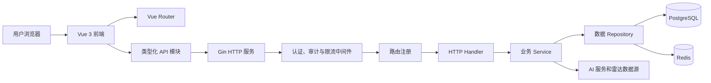
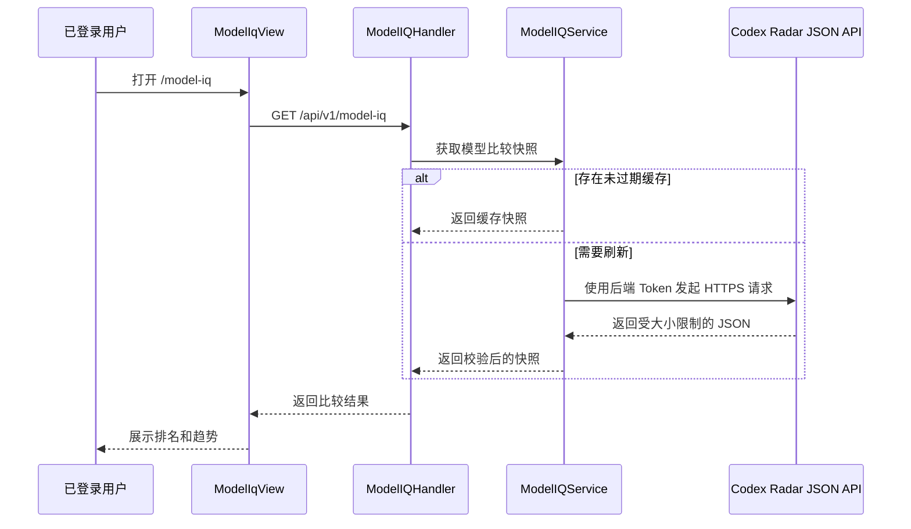
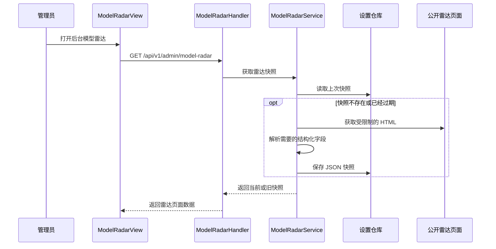

# 4Sub2 私有项目开发与架构说明

本文档用于说明 4Sub2 的私有功能、源代码架构，以及团队后续协作开发时应遵循的约定。

[查看源码恢复记录](RECOVERY.md)

## 仓库信息

| 项目 | 内容 |
| --- | --- |
| 私有仓库 | `Jonesxq/4Sub2` |
| 主分支 | `main` |
| 上游项目 | `Wei-Shaw/sub2api` |
| 上游基线 | `v0.1.161` / `19149ca196eeae4a4482e5299dc6fa4ba0b06c8c` |
| 上游升级标签 | `v0.1.161` |
| 私有功能恢复提交 | `baa4271` |
| 对应生产镜像 | `sub2api:pricing-model-iq-v0.1.160-v2` |
| 当前生产运行版本 | `0.1.160+pricing-radar.model-iq.2` |
| 当前开发运行版本 | `0.1.161+pricing-radar.model-iq.3` |

当前私有功能源码由官方基线、部署时保留的源码冻结包以及生产补丁重建而成。
它是一个功能等价、可以继续协作开发的源码版本，但不能声称与已经丢失的原始生产提交逐字节一致。

如需查看相对官方基线新增的全部私有代码，可执行：

```bash
git diff v0.1.161..HEAD
```

## 私有新增功能

### 1. Model IQ 模型能力对比

Model IQ 为已登录用户提供 GPT 模型测试结果对比页面。页面会依次按照得分、
通过任务数、成本、执行耗时和名称对不同模型配置进行排序，并计算近期得分趋势。

后端职责：

- 代理 Codex Radar JSON 接口，不向浏览器暴露上游 API Token。
- 校验上游地址、响应类型、响应大小和 JSON 数据结构。
- 在服务进程内缓存成功结果。
- 上游刷新失败时返回最后一次成功数据，并标记 `stale: true`。
- 将上游异常转换为稳定、可控的应用错误，不返回敏感错误正文。

前端职责：

- 提供桌面表格和移动端列表两套展示布局。
- 展示得分、通过率、Token 使用量、成本、耗时和近期趋势。
- 处理加载、刷新、旧数据、未授权、限流和网络错误状态。
- 页面离开或重复刷新时取消已经失效的请求。

核心文件：

- [`backend/internal/service/model_iq_service.go`](backend/internal/service/model_iq_service.go)
- [`backend/internal/handler/model_iq_handler.go`](backend/internal/handler/model_iq_handler.go)
- [`backend/internal/handler/model_iq_handler_test.go`](backend/internal/handler/model_iq_handler_test.go)
- [`frontend/src/api/modelIq.ts`](frontend/src/api/modelIq.ts)
- [`frontend/src/views/user/ModelIqView.vue`](frontend/src/views/user/ModelIqView.vue)
- [`frontend/src/views/user/__tests__/ModelIqView.spec.ts`](frontend/src/views/user/__tests__/ModelIqView.spec.ts)

### 2. 模型雷达

模型雷达为管理员提供公开模型额度、速度和质量信息的结构化快照。

后端职责：

- 在严格的超时和响应大小限制下获取公开雷达页面。
- 只解析需要的标题、摘要、表格和模型质量卡片。
- 通过现有设置仓库保存结构化 JSON，不保存第三方原始 HTML。
- 普通快照每 12 小时自动刷新一次。
- 管理员手动刷新存在 30 分钟冷却时间。
- 自动刷新失败时继续返回最后一次成功快照。

前端职责：

- 在管理后台展示额度、速度和质量三个区域。
- 展示数据源时间、本地抓取时间、旧数据状态和下次可刷新时间。
- 允许管理员发起受控的手动刷新。

核心文件：

- [`backend/internal/service/model_radar_service.go`](backend/internal/service/model_radar_service.go)
- [`backend/internal/handler/admin/model_radar_handler.go`](backend/internal/handler/admin/model_radar_handler.go)
- [`backend/internal/server/routes/model_radar.go`](backend/internal/server/routes/model_radar.go)
- [`frontend/src/api/modelRadar.ts`](frontend/src/api/modelRadar.ts)
- [`frontend/src/views/admin/ModelRadarView.vue`](frontend/src/views/admin/ModelRadarView.vue)

### 3. 分组模型价格展示

用户可以在 API Key 页面查看每个可见分组支持的模型价格。鼠标悬停或键盘聚焦
分组标签时，会显示输入、输出、缓存读取、缓存写入、按次或图片价格。

后端接口只返回当前用户有权访问的分组和模型。该功能复用现有渠道可用性和定价规则，
不会建立第二套计费数据源。

核心文件：

- [`backend/internal/handler/available_channel_handler.go`](backend/internal/handler/available_channel_handler.go)
- [`frontend/src/api/channels.ts`](frontend/src/api/channels.ts)
- [`frontend/src/components/keys/GroupPricingPopover.vue`](frontend/src/components/keys/GroupPricingPopover.vue)
- [`frontend/src/views/user/KeysView.vue`](frontend/src/views/user/KeysView.vue)

### 4. 官方价格参考倍率

渠道可以通过 `features_config` 为不同模型配置仅用于展示的价格参考倍率：

```json
{
  "pricing_reference": {
    "source": "official",
    "multipliers": {
      "gpt-5": 0.5,
      "gpt-5-mini": 0.2
    }
  }
}
```

模型名称匹配不区分大小写，只接受大于零的数字倍率。后端返回字段为
`reference_multiplier` 和 `reference_source`。

这些倍率只用于界面展示，不会改变实际计费价格、价格解析缓存或用量计算结果。

核心文件：

- [`backend/internal/service/channel.go`](backend/internal/service/channel.go)
- [`backend/internal/service/channel_available.go`](backend/internal/service/channel_available.go)
- [`backend/internal/handler/available_channel_handler.go`](backend/internal/handler/available_channel_handler.go)
- [`frontend/src/components/channels/PricingRow.vue`](frontend/src/components/channels/PricingRow.vue)
- [`frontend/src/components/channels/SupportedModelChip.vue`](frontend/src/components/channels/SupportedModelChip.vue)

恢复记录中曾使用“自定义版本比较”这一表述。私有补丁中没有独立的应用升级版本比较器，
这里实际指的是 `ModelIqView.vue` 中的模型对比排序和趋势计算逻辑。

## 系统总体架构



### 后端分层

后端是使用 Google Wire 组合依赖的 Go 服务。

| 层级 | 目录 | 主要职责 |
| --- | --- | --- |
| 程序入口 | `backend/cmd/server` | 进程启动、构建信息和依赖初始化 |
| 配置 | `backend/internal/config` | YAML、环境变量、默认值和配置校验 |
| HTTP 服务 | `backend/internal/server` | Gin Router、中间件顺序和路由分组 |
| Handler | `backend/internal/handler` | HTTP 输入输出转换和错误映射 |
| Service | `backend/internal/service` | 业务规则、上游请求、缓存和调度 |
| Repository | `backend/internal/repository` | PostgreSQL、Redis 和持久化抽象 |
| 数据模型 | `backend/internal/model`、`backend/ent` | 领域模型和生成的数据库代码 |
| 安全审计 | `backend/internal/securityaudit` | Prompt 安全检查与审计子系统 |
| 前端嵌入 | `backend/internal/web` | 嵌入前端资源和注入运行配置 |

Handler 应尽量保持轻量，只负责协议转换。业务判断应放在 Service，SQL、Redis 和设置存储
应通过 Repository 接口访问。Service 不应依赖 Vue 页面或前端组件的具体实现。

Wire 的依赖声明位于各个 `wire.go` 文件。修改 Provider 或构造函数依赖后，需要重新生成并提交
`backend/cmd/server/wire_gen.go`。

### 前端分层

前端使用 Vue 3、TypeScript 和 Vite。

| 层级 | 目录 | 主要职责 |
| --- | --- | --- |
| 路由 | `frontend/src/router` | 页面路由、懒加载和访问控制元数据 |
| 页面 | `frontend/src/views` | 用户页面和管理员页面 |
| 组件 | `frontend/src/components` | 可复用的界面与交互组件 |
| API 模块 | `frontend/src/api` | 类型化请求和响应数据结构 |
| 状态管理 | `frontend/src/stores` | Pinia 公共状态和客户端缓存 |
| 国际化 | `frontend/src/i18n` | 中文、英文和日文界面文本 |
| 工具 | `frontend/src/utils` | 格式化和可复用纯函数 |

View 可以组合完整业务流程，但应通过 API 模块调用后端。可复用的展示逻辑应放到组件或工具函数中。
新增用户可见文本时，需要同步补充所有受支持语言。

### 运行依赖

- PostgreSQL 保存用户、渠道、分组、订单等长期数据，模型雷达快照也通过现有设置存储路径保存。
- Redis 为上游 Sub2API 功能提供共享缓存、队列、限流和协调能力。
- Model IQ 使用小型进程内缓存，因为它只代理一个有严格大小限制的比较快照。
- 生产 Go 二进制通过 `embed` 构建标签嵌入已经编译好的前端资源。

## 私有功能请求流程

### Model IQ 请求流程



### 模型雷达请求流程



### 分组价格请求流程

```text
KeysView
  -> GET /api/v1/channels/group-pricing
  -> AvailableChannelHandler.GroupPricing
  -> ChannelService.ListAvailable
  -> 当前用户可见的分组和模型价格
  -> GroupPricingPopover
```

## 私有 API

以下路径都位于 `/api/v1` 下。

| 方法 | 路径 | 权限 | 用途 |
| --- | --- | --- | --- |
| `GET` | `/model-iq` | 已登录用户 | 获取当前 Model IQ 比较快照 |
| `GET` | `/channels/group-pricing` | 已登录用户 | 获取可见分组与模型价格 |
| `GET` | `/admin/model-radar` | 管理员 | 获取当前模型雷达快照 |
| `POST` | `/admin/model-radar/refresh` | 管理员 | 发起受控的手动刷新 |

## Model IQ 配置

API Token 必须通过运行环境提供，禁止提交到 Git 仓库。

```yaml
codex_radar:
  enabled: true
  base_url: https://codexradar.com/api/v1/current
  timeout: 15s
  cache_ttl: 5m
```

```bash
export CODEX_RADAR_API_TOKEN="replace-at-runtime"
```

服务会拒绝非 HTTPS 的上游地址。Token 只保存在后端，不会通过公共设置或 Model IQ 响应返回。

## 源码目录

```text
4Sub2/
|-- backend/
|   |-- cmd/server/                 # Go 程序入口和 Wire 依赖图
|   |-- ent/                        # Ent 生成的数据库代码
|   |-- internal/
|   |   |-- config/                 # 配置和默认值
|   |   |-- handler/                # 用户与管理员 HTTP Handler
|   |   |-- middleware/             # 认证、审计和限流
|   |   |-- model/                  # 领域模型
|   |   |-- repository/             # PostgreSQL 和 Redis 访问
|   |   |-- securityaudit/          # Prompt 安全审计子系统
|   |   |-- server/routes/          # 路由注册
|   |   |-- service/                # 业务逻辑
|   |   `-- web/                    # 嵌入式前端服务
|   |-- migrations/                 # 数据库迁移
|   `-- resources/                  # 后端静态与嵌入资源
|-- frontend/
|   |-- src/
|   |   |-- api/                    # 类型化 HTTP 客户端
|   |   |-- components/             # 可复用组件
|   |   |-- i18n/                   # 多语言文本
|   |   |-- router/                 # Vue 路由
|   |   |-- stores/                 # Pinia 状态管理
|   |   |-- utils/                  # 公共工具
|   |   `-- views/                  # 用户和管理员页面
|   `-- public/                     # 前端静态资源
|-- deploy/                         # Docker Compose 和部署脚本
|-- docs/                           # 功能与运维文档
|-- README_US.md                    # 私有功能和架构说明
`-- RECOVERY.md                     # 源码恢复来源与验证记录
```

## 私有代码文件清单

私有功能新增的后端文件：

```text
backend/internal/handler/admin/model_radar_handler.go
backend/internal/handler/model_iq_handler.go
backend/internal/handler/model_iq_handler_test.go
backend/internal/server/routes/model_radar.go
backend/internal/service/model_iq_service.go
backend/internal/service/model_iq_service_test.go
backend/internal/service/model_radar_service.go
```

私有功能新增的前端文件：

```text
frontend/src/api/modelIq.ts
frontend/src/api/modelRadar.ts
frontend/src/components/keys/GroupPricingPopover.vue
frontend/src/router/__tests__/model-iq-route.spec.ts
frontend/src/views/admin/ModelRadarView.vue
frontend/src/views/user/ModelIqView.vue
frontend/src/views/user/__tests__/ModelIqView.spec.ts
```

其他被修改的官方文件主要用于增加配置、路由、依赖注入、侧边栏入口、多语言文本、
价格响应字段和页面接入。

`backend/internal/securityaudit/prompt_module.go` 中新增的一行 `PromptAdminService` Wire 绑定
属于官方基线构建图修复，不属于私有业务功能。图片输入价格字段原本已经存在于官方
`v0.1.161` 基线，也不属于本次私有新增功能。

## 团队开发流程

克隆私有仓库，并保留官方上游远程：

```bash
git clone git@github.com:Jonesxq/4Sub2.git
cd 4Sub2
git remote add upstream https://github.com/Wei-Shaw/sub2api.git
```

每项功能使用独立分支：

```bash
git switch main
git pull --ff-only origin main
git switch -c feature/short-description
```

正常团队开发不要直接提交到 `main`。应通过 Pull Request 合并，并要求相关测试通过。
提交应保持聚焦、说明清楚，禁止对团队共享分支进行强制推送。

### 前端检查

```bash
cd frontend
pnpm install --frozen-lockfile
pnpm typecheck
pnpm lint:check
pnpm test:run
```

### 后端检查

```bash
cd backend
go test ./internal/config ./internal/handler ./internal/service
go test ./...
```

修改 Wire Provider 后执行：

```bash
cd backend
wire ./cmd/server
```

需要将重新生成的 `backend/cmd/server/wire_gen.go` 与 Provider 修改一起提交。

## 安全与维护规则

- 禁止提交 API Token、SSH 私钥、数据库密码、JWT Secret 或 TOTP 密钥。
- `CODEX_RADAR_API_TOKEN` 只能通过运行环境注入。
- 修改分组价格接口时必须保留用户可见性检查。
- 价格参考倍率应保持“只展示、不计费”，除非后续有独立审核过的计费改动。
- 新增外部数据源时，必须限制请求超时和最大响应大小。
- 应保存解析后的结构化外部数据，不保存不受控的第三方原始页面。
- 新增业务逻辑时应补充后端 Service、Handler 测试和前端状态测试。
- 合并新的官方版本时，应对照当前上游标签重新评估私有功能，不能仅凭 Git 自动合并成功
  就认为功能完全兼容。

## 当前恢复版本验证情况

- 前端类型检查通过。
- 前端 ESLint 检查通过。
- 前端测试通过：175 个测试文件，共 1,209 项测试。
- Wire 依赖生成通过。
- 受影响的后端包已在 Linux 环境编译通过。
- Model IQ 和 Codex Radar 配置相关测试通过。

完整的来源说明和恢复边界请查看 [`RECOVERY.md`](RECOVERY.md)。
