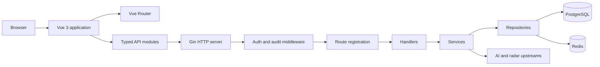
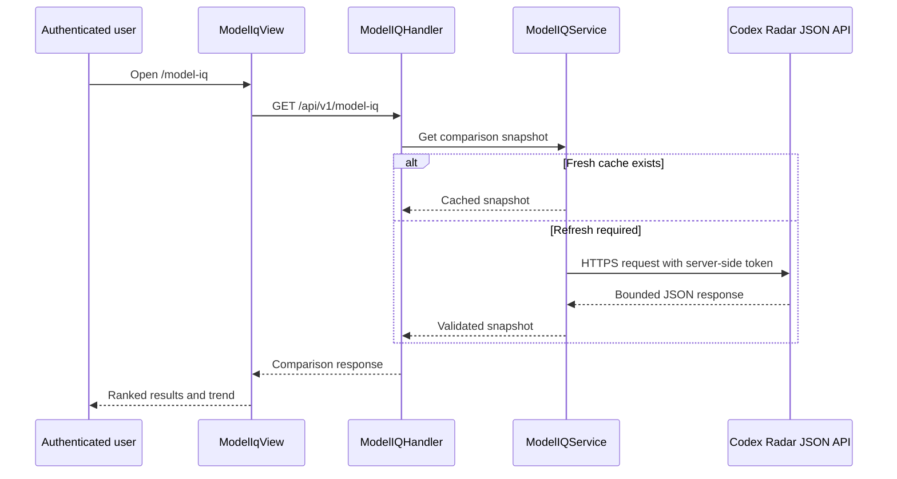
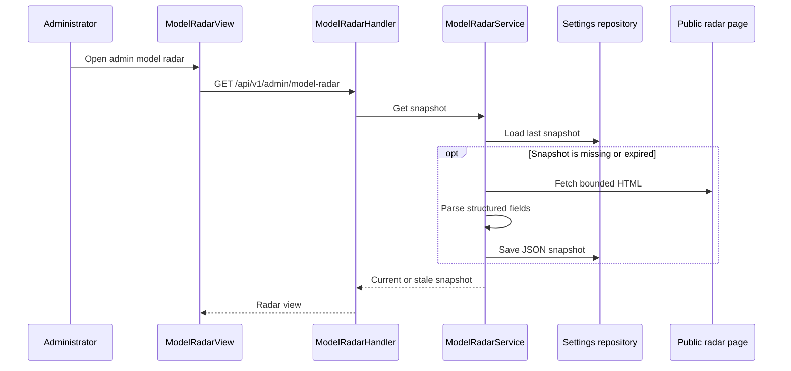

# 4Sub2 Private Development Guide

This document describes the private 4Sub2 feature layer, the source-code
architecture, and the conventions used for continued team development.

[Recovery record](RECOVERY.md)

## Repository identity

| Item | Value |
| --- | --- |
| Private repository | `Jonesxq/4Sub2` |
| Main branch | `main` |
| Upstream project | `Wei-Shaw/sub2api` |
| Upstream baseline | `v0.1.160` / `8bfbc5ca99bf2c0ac96e0f29ffd35eb6aca27e62` |
| Baseline import commit | `ad2fd00` |
| Private feature commit | `538ddd7` |
| Referenced production image | `sub2api:pricing-model-iq-v0.1.160-v2` |
| Referenced runtime version | `0.1.160+pricing-radar.model-iq.2` |

The private feature tree was reconstructed from the upstream baseline, a
deployment source-freeze bundle, and the frozen production patches. It is a
functionally equivalent development source tree. It is not claimed to be
byte-for-byte identical to the unavailable original production commit.

To review only the private layer relative to upstream:

```bash
git diff ad2fd00..main
```

## Private feature set

### 1. Model IQ

Model IQ gives authenticated users a comparison view for GPT model benchmark
results. The page ranks configurations by score, passed tasks, cost, execution
time, and finally label. It also calculates a recent score trend.

Backend responsibilities:

- Proxy the configured Codex Radar JSON endpoint without exposing its API token.
- Validate the upstream URL, media type, response size, and response structure.
- Cache successful responses in memory.
- Return the last known-good snapshot with `stale: true` when refresh fails.
- Map controlled upstream failures to a stable application error.

Frontend responsibilities:

- Render desktop and mobile comparison layouts.
- Show score, pass rate, token use, cost, duration, and recent trend.
- Handle loading, refresh, stale-data, authorization, rate-limit, and network states.
- Cancel obsolete requests when the page is left or refreshed.

Core files:

- [`backend/internal/service/model_iq_service.go`](backend/internal/service/model_iq_service.go)
- [`backend/internal/handler/model_iq_handler.go`](backend/internal/handler/model_iq_handler.go)
- [`backend/internal/handler/model_iq_handler_test.go`](backend/internal/handler/model_iq_handler_test.go)
- [`frontend/src/api/modelIq.ts`](frontend/src/api/modelIq.ts)
- [`frontend/src/views/user/ModelIqView.vue`](frontend/src/views/user/ModelIqView.vue)
- [`frontend/src/views/user/__tests__/ModelIqView.spec.ts`](frontend/src/views/user/__tests__/ModelIqView.spec.ts)

### 2. Model Radar

Model Radar gives administrators a structured snapshot of public quota, speed,
and quality radar information.

Backend responsibilities:

- Fetch the public radar HTML with a bounded timeout and response size.
- Parse only the required headings, summaries, tables, and quality cards.
- Persist structured JSON in the existing settings repository; raw HTML is not stored.
- Refresh normal snapshots every 12 hours.
- Enforce a 30-minute cooldown on manual refreshes.
- Fall back to the last successful snapshot when an automatic refresh fails.

Frontend responsibilities:

- Display quota, speed, and quality sections in the admin interface.
- Show source time, local fetch time, stale state, and refresh availability.
- Allow an administrator to request a controlled refresh.

Core files:

- [`backend/internal/service/model_radar_service.go`](backend/internal/service/model_radar_service.go)
- [`backend/internal/handler/admin/model_radar_handler.go`](backend/internal/handler/admin/model_radar_handler.go)
- [`backend/internal/server/routes/model_radar.go`](backend/internal/server/routes/model_radar.go)
- [`frontend/src/api/modelRadar.ts`](frontend/src/api/modelRadar.ts)
- [`frontend/src/views/admin/ModelRadarView.vue`](frontend/src/views/admin/ModelRadarView.vue)

### 3. Group model pricing

The API key page can show the model prices available to each visible group. A
user hovers or focuses a group badge to inspect input, output, cache-read,
cache-write, per-request, or image pricing as applicable.

The endpoint returns only groups and models visible to the authenticated user.
It reuses the channel availability and pricing rules instead of introducing a
second billing source of truth.

Core files:

- [`backend/internal/handler/available_channel_handler.go`](backend/internal/handler/available_channel_handler.go)
- [`frontend/src/api/channels.ts`](frontend/src/api/channels.ts)
- [`frontend/src/components/keys/GroupPricingPopover.vue`](frontend/src/components/keys/GroupPricingPopover.vue)
- [`frontend/src/views/user/KeysView.vue`](frontend/src/views/user/KeysView.vue)

### 4. Pricing reference multipliers

A channel can attach display-only reference multipliers to model pricing through
its `features_config` value:

```json
{
  "pricing_reference": {
    "source": "official",
    "multipliers": {
      "gpt-5": 0.5,
      "gpt-5-mini": 0.2
    }
  }
}
```

Model matching is case-insensitive. Only positive numeric multipliers are used.
These values are returned as `reference_multiplier` and `reference_source`.
They are for display only and do not alter billing prices, resolver caches, or
usage calculations.

Core files:

- [`backend/internal/service/channel.go`](backend/internal/service/channel.go)
- [`backend/internal/service/channel_available.go`](backend/internal/service/channel_available.go)
- [`backend/internal/handler/available_channel_handler.go`](backend/internal/handler/available_channel_handler.go)
- [`frontend/src/components/channels/PricingRow.vue`](frontend/src/components/channels/PricingRow.vue)
- [`frontend/src/components/channels/SupportedModelChip.vue`](frontend/src/components/channels/SupportedModelChip.vue)

The recovery notes previously called part of this feature set "custom version
comparison." There is no separate application-update version comparator in the
private patch. The custom comparison behavior is the Model IQ ranking and trend
logic in `ModelIqView.vue`.

## System architecture



### Backend boundaries

The backend is a Go service composed with Google Wire.

| Layer | Location | Responsibility |
| --- | --- | --- |
| Entry point | `backend/cmd/server` | Process startup, build information, dependency initialization |
| Configuration | `backend/internal/config` | YAML and environment configuration, defaults, validation |
| HTTP server | `backend/internal/server` | Gin router, middleware order, route groups |
| Handlers | `backend/internal/handler` | HTTP input/output mapping and application error translation |
| Services | `backend/internal/service` | Business rules, upstream coordination, caching, scheduling |
| Repositories | `backend/internal/repository` | PostgreSQL, Redis, and persistence abstractions |
| Models | `backend/internal/model`, `backend/ent` | Domain and generated database models |
| Security audit | `backend/internal/securityaudit` | Prompt security and audit subsystem |
| Embedded web | `backend/internal/web` | Embedded frontend assets and runtime settings injection |

Handlers should remain thin. Business decisions belong in services, while SQL,
Redis, and settings persistence belong behind repository interfaces. A service
must not depend on Vue-specific response behavior.

Wire source definitions live in `wire.go` files. After changing providers or
constructor dependencies, regenerate and commit
`backend/cmd/server/wire_gen.go`.

### Frontend boundaries

The frontend is a Vue 3 and TypeScript application built with Vite.

| Layer | Location | Responsibility |
| --- | --- | --- |
| Routing | `frontend/src/router` | Page routes, lazy loading, access metadata |
| Views | `frontend/src/views` | User and administrator pages |
| Components | `frontend/src/components` | Reusable visual and workflow components |
| API modules | `frontend/src/api` | Typed requests and response contracts |
| Stores | `frontend/src/stores` | Shared Pinia state and client-side caching |
| Internationalization | `frontend/src/i18n` | English, Chinese, and Japanese text |
| Utilities | `frontend/src/utils` | Formatting and shared pure helpers |

Views may compose workflows but should call backend endpoints through API
modules. Reusable display logic belongs in components or utilities. New user-
visible text should be added to every supported locale.

### Runtime dependencies

- PostgreSQL stores durable application data and the Model Radar snapshot through
  the existing settings storage path.
- Redis provides shared cache, queue, rate-limit, and coordination primitives for
  the upstream Sub2API application.
- Model IQ keeps a small process-local cache because it proxies one bounded public
  comparison snapshot.
- The production Go binary embeds the built frontend through the `embed` build tag.

## Private feature request flows

### Model IQ flow



### Model Radar flow



### Group pricing flow

```text
KeysView
  -> GET /api/v1/channels/group-pricing
  -> AvailableChannelHandler.GroupPricing
  -> ChannelService.ListAvailable
  -> user-visible groups and supported model pricing
  -> GroupPricingPopover
```

## Private API surface

All paths below are under `/api/v1`.

| Method | Path | Access | Purpose |
| --- | --- | --- | --- |
| `GET` | `/model-iq` | Authenticated user | Current Model IQ comparison snapshot |
| `GET` | `/channels/group-pricing` | Authenticated user | Visible group-to-model pricing |
| `GET` | `/admin/model-radar` | Administrator | Current Model Radar snapshot |
| `POST` | `/admin/model-radar/refresh` | Administrator | Controlled manual radar refresh |

## Model IQ configuration

The API token must be supplied through the environment. Never commit it to Git.

```yaml
codex_radar:
  enabled: true
  base_url: https://codexradar.com/api/v1/current
  timeout: 15s
  cache_ttl: 5m
```

```bash
export CODEX_RADAR_API_TOKEN="replace-at-runtime"
```

The service rejects non-HTTPS upstream URLs. The token remains backend-only and
is not returned by public settings or Model IQ responses.

## Source tree

```text
4Sub2/
|-- backend/
|   |-- cmd/server/                 # Go entry point and Wire graph
|   |-- ent/                        # Generated Ent database code
|   |-- internal/
|   |   |-- config/                 # Configuration and defaults
|   |   |-- handler/                # User/admin HTTP handlers
|   |   |-- middleware/             # Authentication, audit, limits
|   |   |-- model/                  # Domain models
|   |   |-- repository/             # PostgreSQL and Redis access
|   |   |-- securityaudit/          # Prompt audit subsystem
|   |   |-- server/routes/          # Route registration
|   |   |-- service/                # Business logic
|   |   `-- web/                    # Embedded frontend server
|   |-- migrations/                 # Database migrations
|   `-- resources/                  # Embedded/static backend resources
|-- frontend/
|   |-- src/
|   |   |-- api/                    # Typed HTTP client modules
|   |   |-- components/             # Reusable UI components
|   |   |-- i18n/                   # Localized strings
|   |   |-- router/                 # Vue routes
|   |   |-- stores/                 # Pinia stores
|   |   |-- utils/                  # Shared helpers
|   |   `-- views/                  # User and admin pages
|   `-- public/                     # Static frontend assets
|-- deploy/                         # Docker Compose and deployment scripts
|-- docs/                           # Feature and operations documentation
|-- README_US.md                    # Private development and architecture guide
`-- RECOVERY.md                     # Recovery provenance and verification record
```

## Private code inventory

New backend files introduced by the private feature layer:

```text
backend/internal/handler/admin/model_radar_handler.go
backend/internal/handler/model_iq_handler.go
backend/internal/handler/model_iq_handler_test.go
backend/internal/server/routes/model_radar.go
backend/internal/service/model_iq_service.go
backend/internal/service/model_iq_service_test.go
backend/internal/service/model_radar_service.go
```

New frontend files introduced by the private feature layer:

```text
frontend/src/api/modelIq.ts
frontend/src/api/modelRadar.ts
frontend/src/components/keys/GroupPricingPopover.vue
frontend/src/router/__tests__/model-iq-route.spec.ts
frontend/src/views/admin/ModelRadarView.vue
frontend/src/views/user/ModelIqView.vue
frontend/src/views/user/__tests__/ModelIqView.spec.ts
```

Modified upstream files provide configuration, routes, dependency injection,
navigation, localization, pricing DTOs, and page integration. The one-line
`PromptAdminService` Wire binding in
`backend/internal/securityaudit/prompt_module.go` is a build-graph repair, not a
private business feature. Image-input pricing fields were already present in the
upstream `v0.1.160` baseline.

## Development workflow

Clone the private repository and keep the upstream remote available:

```bash
git clone git@github.com:Jonesxq/4Sub2.git
cd 4Sub2
git remote add upstream https://github.com/Wei-Shaw/sub2api.git
```

Create one branch per change:

```bash
git switch main
git pull --ff-only origin main
git switch -c feature/short-description
```

Do not commit directly to `main` during normal team development. Open a pull
request, require passing tests, and prefer squash or focused commits with clear
messages. Never force-push shared branches.

### Frontend checks

```bash
cd frontend
pnpm install --frozen-lockfile
pnpm typecheck
pnpm lint:check
pnpm test:run
```

### Backend checks

```bash
cd backend
go test ./internal/config ./internal/handler ./internal/service
go test ./...
```

When changing Wire providers:

```bash
cd backend
wire ./cmd/server
```

Commit the regenerated `backend/cmd/server/wire_gen.go` with the provider change.

## Security and maintenance rules

- Never commit API tokens, SSH keys, database passwords, JWT secrets, or TOTP keys.
- Keep `CODEX_RADAR_API_TOKEN` in the runtime environment only.
- Preserve user visibility checks in group-pricing endpoints.
- Keep pricing reference multipliers display-only unless a separately reviewed
  billing change explicitly changes that contract.
- Bound external response size and timeout before adding another upstream source.
- Store structured external data rather than raw third-party pages.
- Add backend tests for service and handler behavior and frontend tests for new
  user-facing states.
- When merging a new upstream release, compare it against `ad2fd00` and reapply or
  adapt the private layer deliberately; do not treat generated merge success as
  proof of behavioral compatibility.

## Verification status of the reconstructed release

- Frontend type checking passed.
- Frontend linting passed.
- Frontend test suite passed: 175 files and 1,209 tests.
- Wire dependency generation passed.
- Affected backend packages compiled on Linux.
- Targeted Model IQ and Codex Radar configuration tests passed.

See [`RECOVERY.md`](RECOVERY.md) for the complete provenance statement and the
limits of the reconstruction claim.
